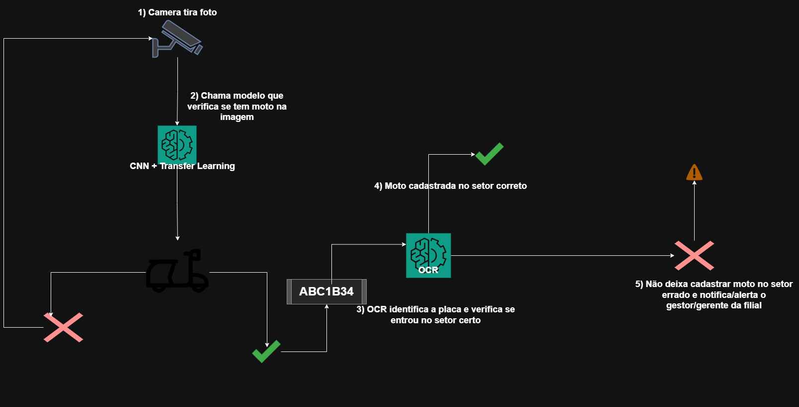

# TriaTag

## Integrantes do Projeto

| Nome             | RM       |
|------------------|----------|
| Alice Nunes      | 559052   |
| Anne Rezendes    | 556779   |
| Guilherme Akira  | 556128   |

---

A **TriaTag** foi desenvolvida para resolver o problema de desorganização na movimentação de motos dentro do pátio da Mottu. Com o uso de câmeras e um sistema inteligente, a TriaTag identifica e organiza automaticamente as motos por setor.

### 1. Iniciar Triagem

Após a moto ser analisada e diagnosticada na triagem, o funcionário seleciona na aplicação para qual setor a moto deve ser colocada. Se por um acaso a mesma for posta no setor errado, o sistema impedirá o cadastro dessa moto em tal setor.

### 2. Localizar Moto

Na aplicação, ao inserir a placa da moto:
- O sistema informa **em qual setor** a moto está localizada.
- É possível **acionar a buzina e o pisca-alerta** remotamente (via IoT), ajudando o funcionário a encontrar a moto rapidamente dentro do pátio.

### 3. Ver Motos no Pátio

O usuário:
- Informa o **código da filial**.
- Seleciona o **setor desejado**.
- O sistema lista **todas as motos presentes naquele setor**, em tempo real.

---

# Detecção de Moto com CNN + Transfer Learning e OCR de Placas

Este projeto tem como objetivo principal a detecção de motocicletas em imagens utilizando uma Rede Neural Convolucional (CNN) e a técnica de Transfer Learning com o modelo MobileNetV2, e, adicionalmente, a identificação da placa da moto via OCR (Optical Character Recognition).

## Conteúdo do Repositório

O repositório está organizado da seguinte forma:

* `detectar_moto.ipynb`: O notebook Jupyter que contém todo o código para o treinamento, avaliação e salvamento do modelo de detecção de motos.
* `ocr.ipynb`: O notebook Jupyter que contém o código para testar e demonstrar o uso do EasyOCR para identificar a placa das motocicletas a partir de imagens.
* `data/`: Uma pasta contendo as imagens de treino e teste que foram utilizadas para o treinamento e validação do modelo. As imagens foram organizadas manualmente para facilitar o processo.
    * `data/train/`: Contém as imagens usadas para o treinamento do modelo.
    * `data/test/`: Contém as imagens usadas para a avaliação final do modelo.
    * `data/placa/`: Contém uma imagem de exemplo de uma placa para testar o OCR.
* `modelo.keras`: O modelo treinado da IA (para detecção de moto), salvo no formato `.keras`. Este arquivo pode ser carregado diretamente para fazer previsões em novas imagens.
* `arquitetura.png`: A imagem da arquitetura mostrando como a IA vai ser utilizada na solução/projeto.

## Visão Geral do Projeto

O projeto utiliza Transfer Learning, que é uma técnica onde um modelo pré-treinado em um grande conjunto de dados (neste caso, MobileNetV2 treinado no ImageNet) é adaptado para uma nova tarefa (detecção de motos). Isso acelera o treinamento e melhora o desempenho, especialmente quando se tem um conjunto de dados menor.

Além da detecção, o projeto também integra a funcionalidade de Reconhecimento Óptico de Caracteres (OCR) para extrair as informações da placa da moto, essencial para a gestão e localização no pátio.

### Detecção de Moto (`detectar_moto.ipynb`)

O notebook `detectar_moto.ipynb` aborda os seguintes passos:

1.  **Instalação de Dependências**: Instala as bibliotecas necessárias.
2.  **Preparação dos Dados**: Carrega e pré-processa as imagens de treino e teste, aplicando aumentações de dados para melhorar a robustez do modelo.
3.  **Construção do Modelo**: Utiliza MobileNetV2 como base, adicionando camadas personalizadas para a classificação binária (moto ou não moto).
4.  **Treinamento do Modelo**: Treina o modelo com os dados preparados.
5.  **Avaliação do Modelo**: Avalia o desempenho do modelo nos dados de teste.
6.  **Salvando o Modelo**: Salva o modelo treinado em `modelo.keras`.
7.  **Carregando e Testando o Modelo**: Demonstra como carregar o modelo salvo e fazer previsões.

### Reconhecimento de Placa (OCR) (`ocr.ipynb`)

O notebook `ocr.ipynb` demonstra a aplicação do EasyOCR para extração de texto de imagens, especificamente focado na identificação de placas de motocicletas. Os principais pontos abordados são:

1.  **Instalação e Configuração**: Instala as bibliotecas necessárias para o EasyOCR.
2.  **Carregamento de Imagem**: Carrega uma imagem de uma placa de moto.
3.  **Execução do OCR**: Utiliza o EasyOCR para detectar e reconhecer texto na imagem.
4.  **Pós-processamento e Validação**: Implementa lógicas para filtrar e validar o texto reconhecido, buscando padrões de placas para garantir a precisão da identificação.

## Arquitetura do Sistema e Fluxo de Utilização

Este projeto foi concebido para ser parte de um sistema maior (TriaTag), onde a inteligência artificial atua como um componente central para a detecção de motocicletas e a identificação de suas placas em tempo quase real.

Abaixo está um diagrama que ilustra o fluxo de dados e a interação entre os componentes:

**Descrição do Fluxo:**

1.  **Câmera/Sensor de Imagem**: Uma câmera ou outro sensor de imagem captura frames ou fotos do ambiente (ex: entrada de setores do pátio).
2.  **Captura e Envio de Imagem**: As imagens capturadas são enviadas para o módulo de processamento.
3.  **Módulo de IA (CNN + Transfer Learning)**:
    * Recebe a imagem.
    * Pré-processa a imagem (redimensionamento, normalização, etc.) para o formato esperado pelo modelo.
    * Carrega o modelo de IA (`modelo.keras`).
    * Realiza a inferência (previsão) na imagem para determinar se há uma moto presente.
4.  **Saída da Predição de Detecção**: O resultado da inferência (ex: "Moto Detectada" ou "Nenhuma Moto") é gerado.
5.  **Módulo de IA (OCR)**: Se uma moto for detectada pelo modelo de CNN:
    * Recebe a imagem (ou a região da imagem onde a moto foi detectada, para otimização).
    * Utiliza o EasyOCR para identificar e extrair o texto da placa da moto.
6.  **Ações e Tomada de Decisão**: Com base na detecção da moto e na identificação da placa, o sistema pode tomar ações, especialmente em cenários de "Início de Triagem" ou "Localização de Moto":
    * **Validação de Setor**: Se a moto estiver sendo direcionada para um setor incorreto, o sistema pode:
        * Não permitir o cadastro da moto nesse setor.
        * Notificar o gerente da filial sobre o ocorrido.
    * **Auxílio na Localização**: Para a funcionalidade "Localizar Moto", a placa identificada pela câmera pode ser cruzada com o banco de dados para confirmar a moto e acionar as funções IoT (buzina, pisca-alerta).

Este fluxo demonstra como os modelos de detecção de motos e OCR desenvolvidos neste repositório são integrados em uma aplicação prática para otimizar a gestão de veículos no pátio.
